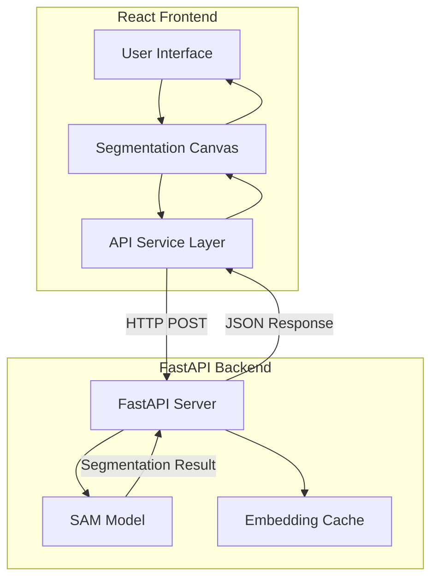
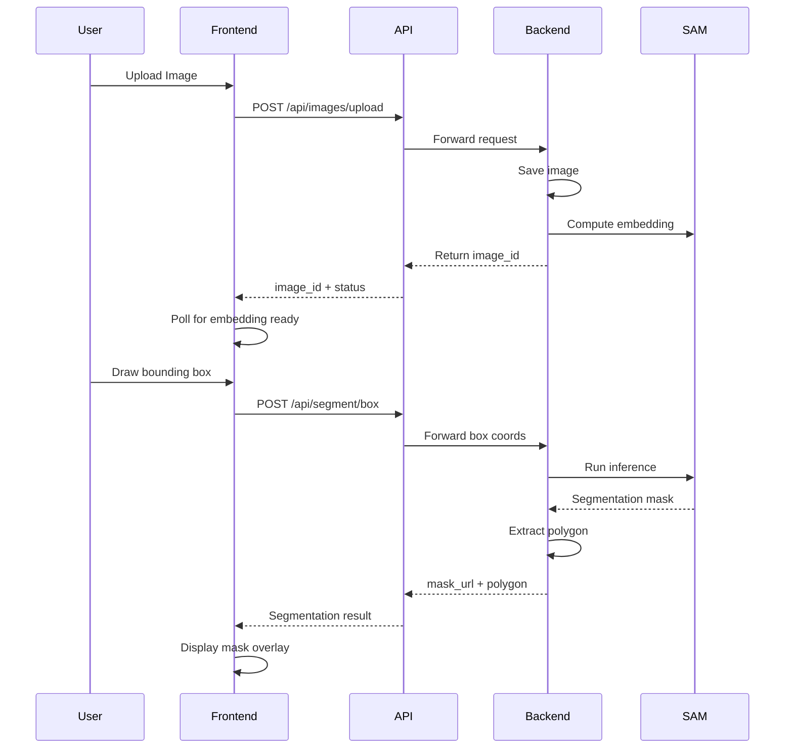

# Frontend-Backend Integration Plan for Medical Image Segmentation

## Overview

This plan outlines the architecture for connecting the React frontend with the SAM (Segment Anything Model) backend to enable real-time medical image segmentation.

## Current Architecture Analysis

### Frontend (React + TypeScript)
- **Location**: `welcome-hub/src/`
- **Key Components**:
  - [`SegmentationCanvas.tsx`](welcome-hub/src/components/SegmentationCanvas.tsx) - Canvas-based annotation with box, paint, outline, and eraser tools
  - [`useSegmentationState.ts`](welcome-hub/src/hooks/useSegmentationState.ts) - State management for segmentation tools
  - [`ToolSidebar.tsx`](welcome-hub/src/components/ToolSidebar.tsx) - UI controls for tool selection
  - [`SegmentationTool.tsx`](welcome-hub/src/pages/SegmentationTool.tsx) - Main page component

### Backend (PyQt5 + SAM)
- **Location**: `backend/`
- **Current State**: Desktop GUI application with SAM model integration
- **Key Functions**:
  - `sam_inference()` - Runs SAM model for segmentation
  - `EmbeddingThread` - Pre-computes image embeddings
  - Supports box prompts and polygon outlines

## Proposed Architecture



## API Design

### Endpoints

#### 1. Upload Image
```
POST /api/images/upload
Content-Type: multipart/form-data

Request:
- file: image file (JPG, PNG, etc.)

Response:
{
  "image_id": "uuid-string",
  "width": 1024,
  "height": 768,
  "embedding_status": "computing" | "ready"
}
```

#### 2. Check Embedding Status
```
GET /api/images/{image_id}/status

Response:
{
  "image_id": "uuid-string",
  "embedding_ready": true,
  "message": "Embedding computed successfully"
}
```

#### 3. Segment with Box Prompt
```
POST /api/segment/box
Content-Type: application/json

Request:
{
  "image_id": "uuid-string",
  "box": {
    "x": 100,
    "y": 150,
    "width": 300,
    "height": 250
  },
  "class_name": "Uterus"
}

Response:
{
  "image_id": "uuid-string",
  "mask_url": "/api/images/{image_id}/mask",
  "polygon": [
    {"x": 100, "y": 150},
    {"x": 400, "y": 150},
    {"x": 400, "y": 400},
    {"x": 100, "y": 400}
  ],
  "class_name": "Uterus",
  "color": [0, 255, 255]
}
```

#### 4. Segment with Polygon Prompt
```
POST /api/segment/polygon
Content-Type: application/json

Request:
{
  "image_id": "uuid-string",
  "polygon": [
    {"x": 100, "y": 150},
    {"x": 400, "y": 150},
    {"x": 350, "y": 400},
    {"x": 120, "y": 380}
  ],
  "class_name": "Uterus"
}

Response:
{
  "image_id": "uuid-string",
  "mask_url": "/api/images/{image_id}/mask",
  "polygon": [...],
  "class_name": "Uterus",
  "color": [0, 255, 255]
}
```

#### 5. Get Mask Image
```
GET /api/images/{image_id}/mask

Response: PNG image (binary)
```

#### 6. Get Original Image
```
GET /api/images/{image_id}

Response: Image file (binary)
```

## Data Flow



## File Structure

### Backend (New Files)
```
backend/
├── main.py                 # FastAPI application entry point
├── routers/
│   ├── __init__.py
│   ├── images.py           # Image upload and retrieval
│   └── segment.py          # Segmentation endpoints
├── services/
│   ├── __init__.py
│   ├── sam_service.py      # SAM model wrapper
│   └── embedding_cache.py  # Embedding cache management
├── models/
│   ├── __init__.py
│   └── schemas.py          # Pydantic models for API
├── utils/
│   └── image_utils.py      # Image processing utilities
├── config.py               # Configuration settings
└── requirements.txt        # Updated dependencies
```

### Frontend (New Files)
```
welcome-hub/src/
├── services/
│   └── api.ts              # API client for backend communication
├── types/
│   └── segmentation.ts     # TypeScript interfaces
└── components/
    └── SegmentationCanvas.tsx  # Updated with API integration
```

## Implementation Details

### Backend Changes

1. **FastAPI Server Setup**
   - Create `main.py` with FastAPI app
   - Add CORS middleware for frontend communication
   - Configure static file serving for images

2. **SAM Service**
   - Extract SAM model logic from `gui_main.py`
   - Create singleton pattern for model loading
   - Implement async embedding computation

3. **Embedding Cache**
   - Use in-memory cache with LRU eviction
   - Support file-based persistence for large datasets
   - Background task for pre-computation

4. **Image Processing**
   - Convert images to SAM-compatible format
   - Extract polygon contours from masks using OpenCV
   - Generate overlay images

### Frontend Changes

1. **API Service Layer**
   - Create typed API client with fetch
   - Handle loading states and errors
   - Implement polling for embedding status

2. **SegmentationCanvas Updates**
   - Add image upload functionality
   - Send box/polygon coordinates to backend
   - Display returned mask overlay
   - Show polygon outline on canvas

3. **State Management**
   - Add image_id to segmentation state
   - Track embedding computation status
   - Store segmentation results per class

## Configuration

### Backend Environment Variables
```env
SAM_CHECKPOINT_PATH=./work_dir/sam_model/sam_vit_b.pth
SAM_MODEL_TYPE=vit_b
DEVICE=cuda  # or cpu, mps
MAX_CACHE_SIZE=100
UPLOAD_DIR=./uploads
EMBEDDING_DIR=./embeddings
```

### Frontend Environment Variables
```env
VITE_API_URL=http://localhost:8000
```

## Dependencies

### Backend (Additions)
```
fastapi>=0.104.0
uvicorn>=0.24.0
python-multipart>=0.0.6
aiofiles>=23.2.1
```

### Frontend (No new dependencies required)
- Using native fetch API
- Existing React hooks

## Error Handling

### Backend
- Validate image formats
- Handle missing embeddings gracefully
- Return meaningful error messages
- Log errors for debugging

### Frontend
- Display loading indicators during API calls
- Show error messages to user
- Retry failed requests
- Handle network timeouts

## Testing Strategy

1. **Unit Tests**
   - Test SAM service methods
   - Test polygon extraction
   - Test API endpoints

2. **Integration Tests**
   - Test full segmentation workflow
   - Test concurrent requests
   - Test cache behavior

3. **End-to-End Tests**
   - Upload image → segment → display result
   - Multiple segmentation on same image
   - Error scenarios

## Migration Path

1. **Phase 1**: Create FastAPI backend alongside existing PyQt5 app
2. **Phase 2**: Implement core endpoints (upload, segment)
3. **Phase 3**: Update frontend to use new API
4. **Phase 4**: Add advanced features (polygon, multi-class)
5. **Phase 5**: Remove PyQt5 code once stable

## Security Considerations

- Validate file types on upload
- Limit file size
- Sanitize input coordinates
- Rate limiting for API endpoints
- CORS configuration for production
